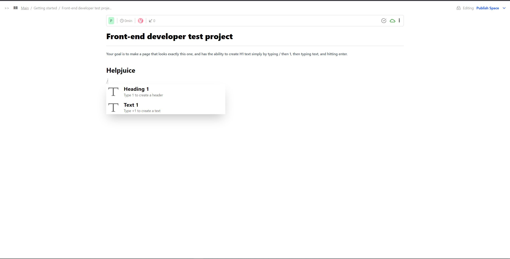

# Helpjuice-project,



> In this project, a simple text editor has been created.

## Built With

- CSS
- JavaScript
- HTML
- npm
- Webpack
- Tailwind css

## Live Demo and video (if available)

[Video Link](https://drive.google.com/drive/u/1/folders/1MqpIcdyI0zGZF06pql41qjwv4bRzx8vO)

[Live Demo Link](https://helpjuice-aosi9idly-fsher07.vercel.app/)

## Getting Started

To get a local copy up and running follow these simple example steps.

-To run the project locally, clone the project using the commands and link below:

-git clone https://github.com/Fsher07/Helpjuice.git

### Setup

-To start the project locally, use the commands and link below:

```
  npm install
```

```
  npm start
```

## Author

👤 **Furkan Salim Hıdır**

- GitHub: [Salim](https://github.com/Fsher07)
- LinkedIn: [Salim](https://www.linkedin.com/in/furkan-salim-h%C4%B1d%C4%B1r-3441ab1b2/)

## 🤝 Contributing

Contributions, issues, and feature requests are welcome!

Feel free to check the [issues page](../../issues/).

## Show your support

Give a ⭐️ if you like this project!
